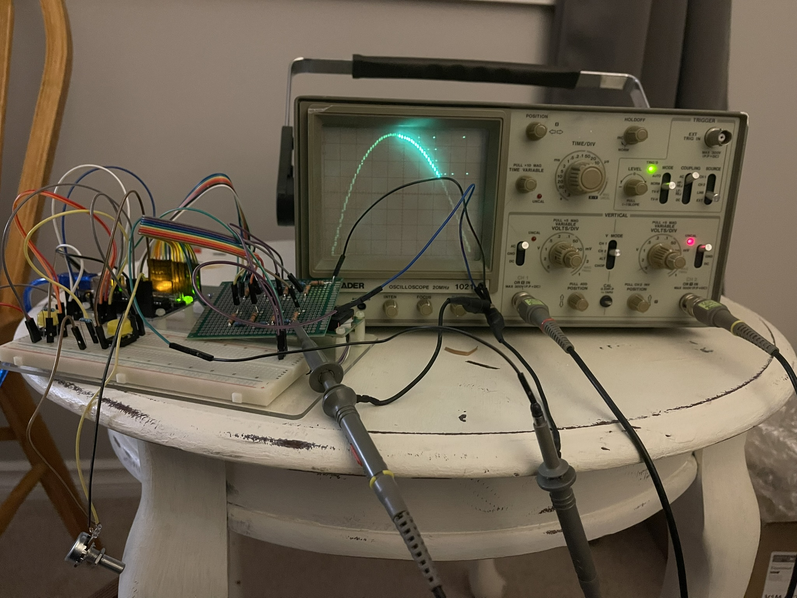
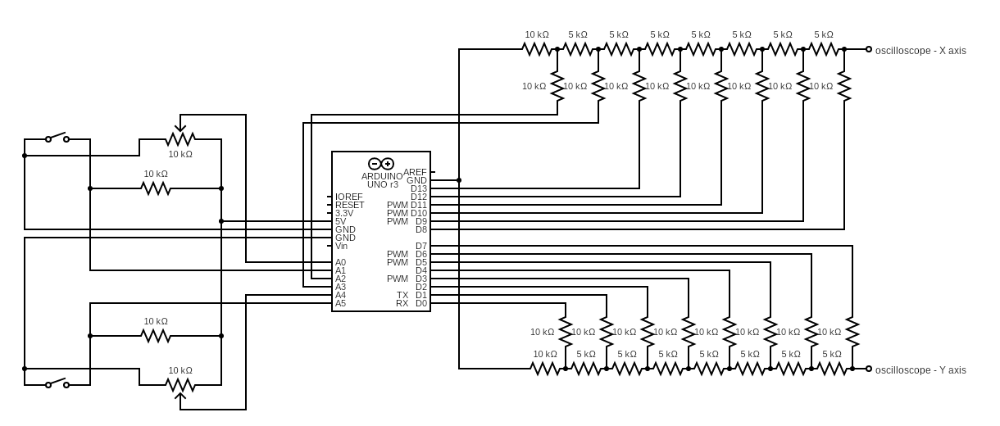
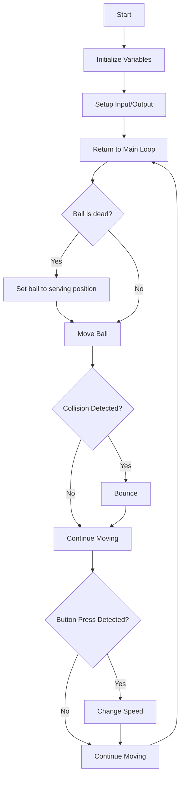

# Tennis-for-Two-by-Arduino
This is a recreation of the first video game, "Tennis for Two," using Arduino as the signal source.
This *Tennis for Two* recreation was developed for my school project. It is adapted from [code and tutorial by Windell Oskay of Evil Mad Scientist Laboratories](https://www.evilmadscientist.com/2008/resurrecting-tennis-for-two-a-video-game-from-1958/)

## Tennis for Two

"Tennis for Two," developed in 1958 by physicist **William Higinbotham**, is one of the earliest video games. It was created for a visitor's day at the **Brookhaven National Laboratory** in New York. This simple game, which displays a tennis court on an oscilloscope, allows players to control a virtual ball with knobs and buttons.

## The Recreation of "Tennis for Two"

### Signal Source

The signal source is an Arduino Uno board. The Arduino board is easy to reach, easy to be programmed, and easy to be connected with other components. It's much easier than dealing with other microcontrollers.

### Display

The display is an oscilloscope, a device used to display the waveforms of electronic signals. In this project, I use a Leader 1021 oscilloscope to display the game, but any other oscilloscope with X-Y mode can be used.

### Control

The control is a potentiometer and a button. The potentiometer is used to control the angle of the ball, and the button is to hit the ball.

### Digital to Analog Converter (DAC)

An oscilloscope can only display analog signals, so we need a DAC (Digital-to-Analog Converter) to convert the digital signals from the Arduino into analog signals. In this project, I use an R-2R ladder to perform this conversion. The R-2R ladder is the simplest method to build a DAC. However, it may not be very accurate and it uses a significant number of pins. 

In an R-2R DAC, each digital input bit is connected to a corresponding 'rung' of the ladder network. The number of rungs is directly related to the resolution of the DAC. For example, an 8-bit DAC has 8 rungs, its resolution is 2^8 = 256. 

Below is the formula to calculate the output voltage of an R-2R DAC:

$$ V_{\text{out}} = V_{\text{ref}} \times \left( \frac{D_0}{2^N} + \frac{D_1}{2^{N-1}} + \frac{D_2}{2^{N-2}} + \cdots + \frac{D_{N-1}}{2^1} \right)$$

$V_{\text{ref}}$ is the reference voltage (5V in this project)  
$D_0$ to $D_{N-1}$ are the digital inputs (0 or 1)  
$N$ is the number of bits (8 in this project)

I choose an 8-bit DAC because it's the maximum number of pins available on the Arduino Uno board. I also attached a Python script to calculate the output voltage of an R-2R DAC. You can find it in the folder "tennisTool".

## The Circuit

The pins assigned to the first DAC (Y axis) are 0, 1, 2, 3, 4, 5, 6, 7, which I can easily manipulate with the PORTD function. As for the second DAC (X axis), unfortunately, the last two pins of PORTB (PB6 and PB7) are occupied for the crystal oscillator, so I have to use A2 and A3 instead.

For the controller, we need a potentiometer and a button. The output of the potentiometer is marked as brown, and the button output is marked as blue. The two controllers occupy all the remaining ports of the Arduino. The 10k resistor between GND and the button functions as a pull-up resistor.

According to the formula above, if the input is 11111111 (255 in decimal), the output will be around $4.9804V$, which is a $0.4\%$ loss in voltage.

The input of the DAC can be described as binary numbers from 0b00000000 to 0b11111111, where each digit represents the on and off state of each pin (HIGH or LOW in Arduino). We can also express them in decimal, which is 0-255.     
After we hook up the circuit with the oscilloscope, we are able to control the output voltage from $0$~$5V$, with 256 steps. For the X-Y mode, it turns into a plane with coordinates from 0-255 on each axis. By far, we can easily control the pixel that is displayed on the oscilloscope.

You can use the file [parabola.ino](parabola/parabola.ino) to test if your circuit is working fine.

Visual Circuit Diagram 1

Visual Circuit Diagram 2

Actual Circuit

## Programming

### Game logic

### The Code

refer to the file [tennis.ino](tennis/tennis.ino)
