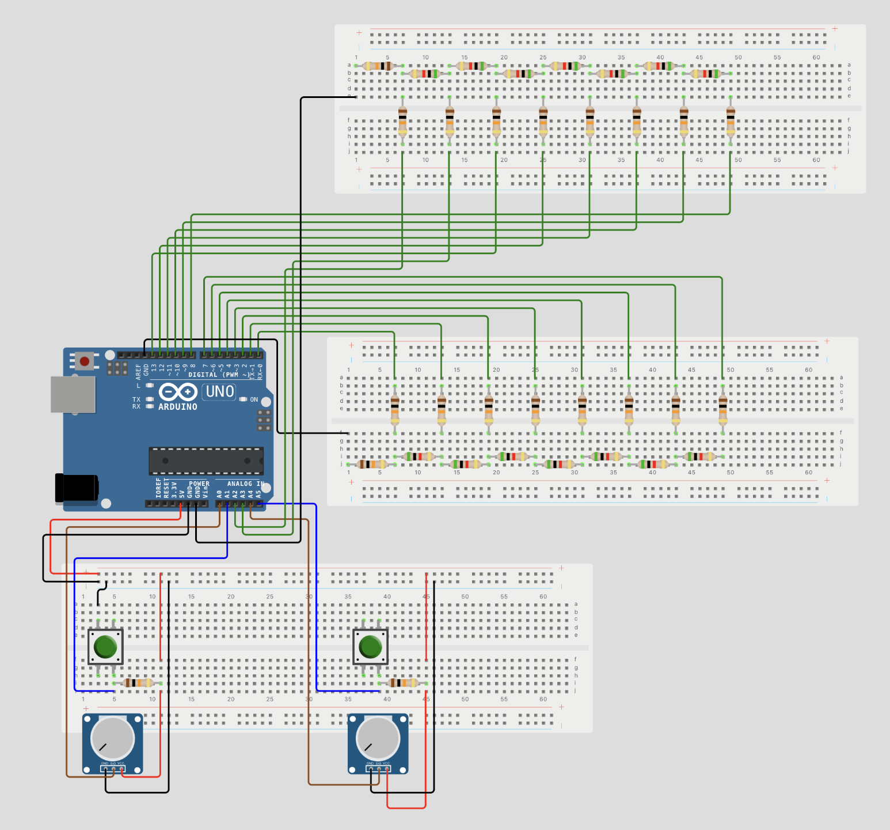
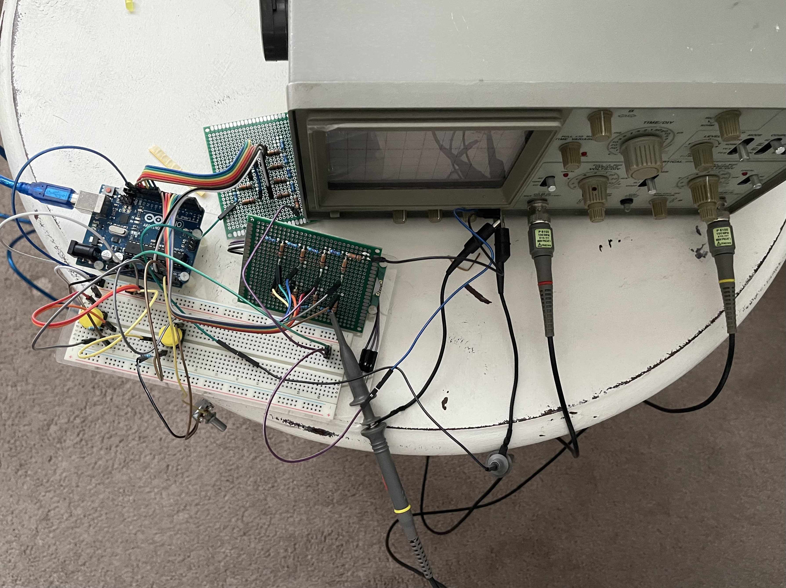
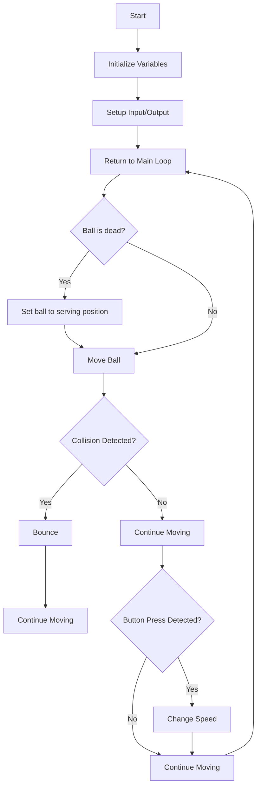

# Tennis-for-Two-by-Arduino
This is a recreation of the first video game, "Tennis for Two," using Arduino as the signal source.

## Tennis for Two

"Tennis for Two," developed in 1958 by physicist **William Higinbotham**, is one of the earliest video games. It was created for a visitor's day at the **Brookhaven National Laboratory** in New York. This simple game, which displays a tennis court on an oscilloscope, allows players to control a virtual ball with knobs and buttons.

## The Recreation of "Tennis for Two"

### Signal Source

The signal source is an Arduino Uno board. The Arduino board is easy to reach, easy to be programmed, and easy to be connected with other components. It's much easier than dealing with other microcontrollers.

### Display

The display is an oscilloscope, a device used to display the waveforms of electronic signals. In this project, I use a Leader 1021 oscilloscope to display the game, but any other oscilloscope with X-Y mode can be used.

### Control

The control is a potentiometer and a button. The potentiometer is used to control the angle of the ball, and the button is to hit the ball.

### Digital to Analog Converter (DAC)

An oscilloscope can only display analog signals, so we need a DAC (Digital-to-Analog Converter) to convert the digital signals from the Arduino into analog signals. In this project, I use an R-2R ladder to perform this conversion. The R-2R ladder is the simplest method to build a DAC. However, it may not be very accurate and it uses a significant number of pins. 

In an R-2R DAC, each digital input bit is connected to a corresponding 'rung' of the ladder network. The number of rungs is directly related to the resolution of the DAC. For example, an 8-bit DAC have 8 rungs, its resolution is 2^8 = 256. 

Below is the formula to calculate the output voltage of an R-2R DAC:

$$ V_{\text{out}} = V_{\text{ref}} \times \left( \frac{D_0}{2^N} + \frac{D_1}{2^{N-1}} + \frac{D_2}{2^{N-2}} + \cdots + \frac{D_{N-1}}{2^1} \right)$$

$V_{\text{ref}}$ is the reference voltage (5V in this project)  
$D_0$ to $D_{N-1}$ are the digital inputs (0 or 1)  
$N$ is the number of bits. (8 in this project)

I choose 8-bit DAC because it's the maximum of pins available on the Arduino Uno board.
I also attached a python script to calculate the output voltage of an R-2R DAC. You can find it in the folder "tennisTool".

## The Circuit

The pins assigned to the first DAC (Y axis) are 0, 1, 2, 3, 4, 5, 6, 7, which I can easily manipulate with PORTD function. As for the second DAC (X axis), unfortunately, the last two pins of PORTB (PB6 and PB7) are used for the crystal oscillator, so I have to use A2 and A3 instead.

visual circuit diagram 1

visual circuit diagram 2

actual circuit

## Programming

### Game logic

### The Code

refer to the file "tennis.ino"

